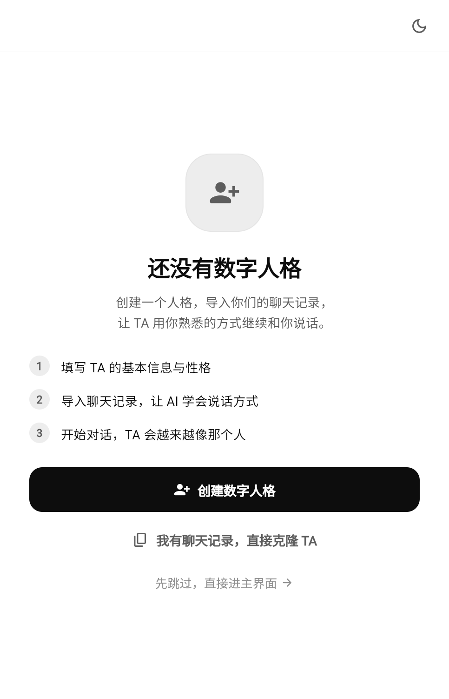
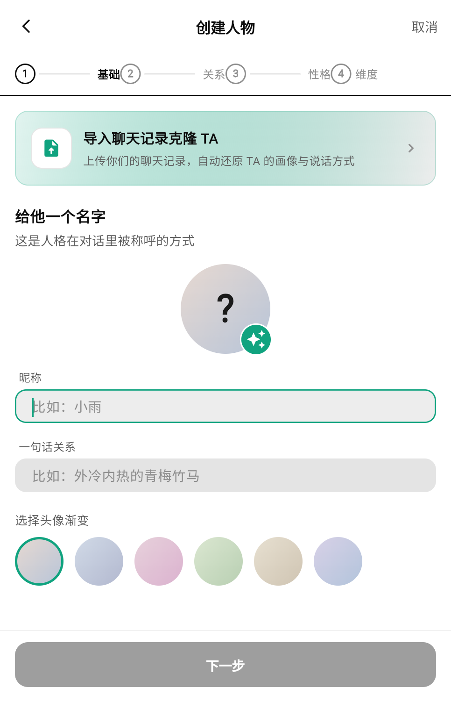
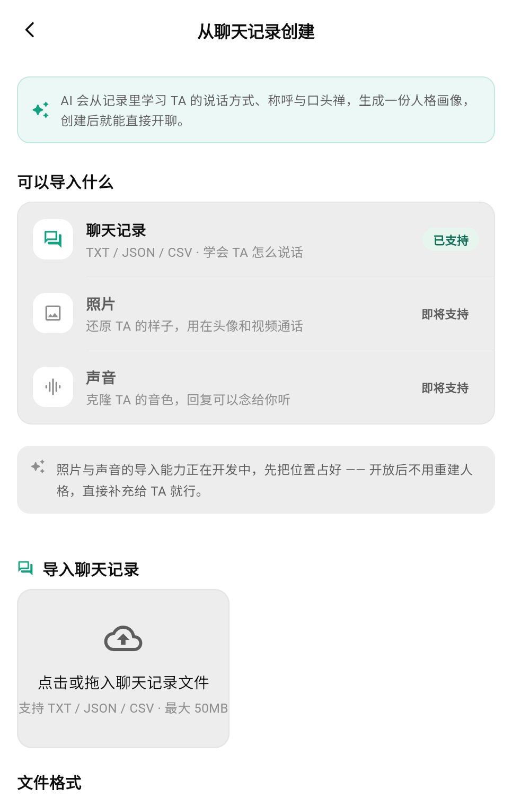
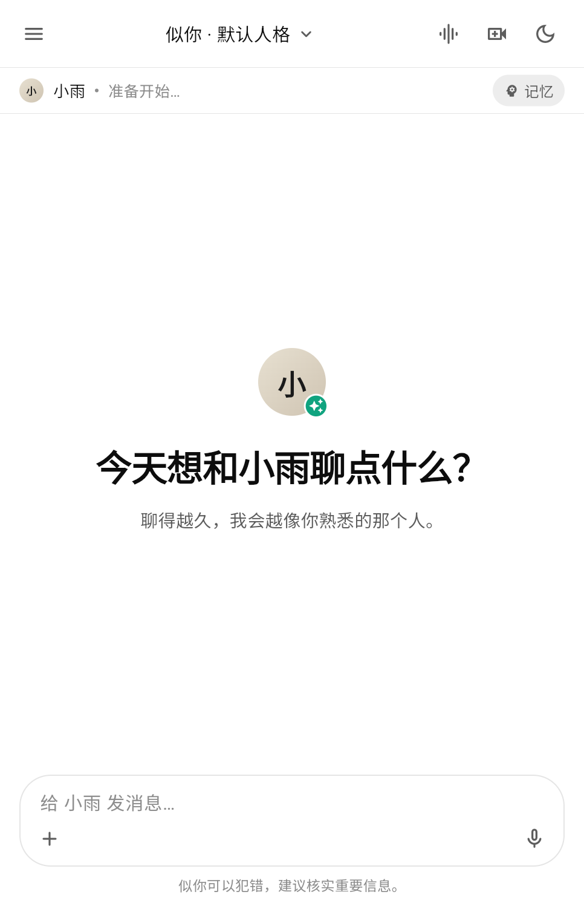

<div align="center">

# 似你 · Sini

**把你和 TA 的聊天记录，变成 TA 的说话方式 —— 一个端侧优先的 AI「数字人格」聊天应用**

[](https://flutter.dev)
[](https://dart.dev)
[](#)
[](#)
[](LICENSE)
[](#)

</div>

---

## 📖 目录

- [这是什么](#-这是什么)
- [界面预览](#-界面预览)
- [核心特性](#-核心特性)
- [技术栈](#-技术栈)
- [项目结构](#-项目结构)
- [快速开始](#-快速开始)
- [端侧模型说明](#-端侧模型说明)
- [隐私设计](#-隐私设计)
- [Roadmap](#-roadmap)
- [免责声明](#-免责声明)
- [License](#-license)

---

## 🌱 这是什么

**似你（Sini）** 是一个 Flutter 编写的 AI 聊天应用，但它解决的不是"怎么和 AI 聊天"，而是：

> **怎么让 AI 变成你熟悉的那个 TA。**

它和普通 AI 聊天应用的区别：

| 普通 AI 聊天 | 似你 |
|---|---|
| 你先学会怎么"调教" AI | **导入聊天记录，让 AI 自己学会 TA 怎么说话** |
| 人格靠你手写提示词 | 自动提取称呼、口头禅、说话长度、语气 |
| 聊完就忘 | **记忆库 + 情绪曲线**，越聊越像 |
| 只打字 | 端侧语音克隆：**用 TA 的音色念给你听** |
| 数据在云端 | **人格 / 记忆 / 对话默认只存本机**；语音克隆在本机推理 |

---

## 📱 界面预览

<div align="center">

| 首次进入 | 创建人格 |
|:---:|:---:|
|  |  |
| **从聊天记录创建** | **开始对话** |
|  |  |

</div>

---

## ✨ 核心特性

### 1️⃣ 人格克隆（核心能力）

| 能力 | 说明 |
|---|---|
| **聊天记录克隆** | 导入 `TXT / JSON / CSV` 聊天记录，自动分析说话风格、称呼、口头禅，生成"人格画像" |
| **四步创建向导** | 基础 → 关系 → 性格 → 维度，也支持跳过向导直接对话 |
| **人格编辑** | 名字 / 关系 / 用你自己的话描述 TA（优先级最高，AI 严格遵循） |
| **人格养成卡** | 把人格打包成卡片**分享 / 导入**，也可以带走去别的设备 |
| **人格实验室** | 人格完整度、预设模板、维度调节 |

### 2️⃣ 聊天体验

- 流式回复、Markdown 渲染、**回复内嵌图表**（` ```chart ` 数据块直接画成柱状/折线/饼图）
- **消息撤回 / 编辑重发**（改完自己的话让 TA 重新理解）、**引用回复**、长按复制
- **角色扮演模式**：让 TA 按设定场景演下去
- **联网搜索**：需要时效信息时由 TA 主动检索
- **记忆库**：重要信息自动沉淀，长期可用

### 3️⃣ 情感与关系

- **恋爱感引擎**：情绪 / 互动信号 / 边界感建模
- **主动引擎**：TA 会主动找你说话，而不是永远等你开口
- **情绪曲线**：把情绪数据画成曲线，看 TA 的起伏
- **TA 的朋友圈**：TA 有自己的主页与动态
- **每周故事**：自动生成"这一周你们的故事"
- **晚安守护**：深夜高频聊天时的关怀逻辑

### 4️⃣ 语音（全部端侧）

| 能力 | 实现 |
|---|---|
| **声音克隆** | `sherpa-onnx` + ZipVoice 零样本克隆，**本机推理，样本用完即弃** |
| **流式语音识别** | 端侧 Zipformer 中英双语模型，实时转写 |
| **系统语音输入** | `speech_to_text`（安卓/iOS 系统识别） |
| **语音 / 视频通话界面** | 会话式语音交互 UI |
| **参考音频管理** | 本地保存参考样本、合成预览 |

### 5️⃣ 多模态与工具

- **照片识别**、**文档识别**（`docx / pptx / xlsx` 本质是 zip+XML，解包抽正文）
- **图片生成**
- **连接器**：QQ 邮箱、GitHub 等账号接入
- **邮件明信片**：给 TA 或朋友写一封真正的邮件
- **自动化系统**：定时任务 + 管理面板 + 后台执行

### 6️⃣ 工程能力

- **Token 用量面板 + 用量小票**，随时看花了多少
- **响应式布局**：手机端与 Web 端同一套代码
- **端侧模型挂载**：按 platform 自动挂载/回退（`model_mount_*`）
- 约 **3.2 万行 Dart**，`flutter_lints` 全绿

---

## 🧱 技术栈

| 分类 | 选型 | 用途 |
|---|---|---|
| 框架 | **Flutter 3.x / Dart ≥ 3.3** | 一套代码跑 Android / iOS / Web |
| 网络 | `dio` | LLM 与业务 API 请求、流式响应 |
| 端侧语音 | `sherpa_onnx` ^1.13.7 | **流式识别 + ZipVoice 零样本声音克隆** |
| 录音 | `record` ^7.1.1 | 麦克风采集（PCM16 / 16kHz / 单声道，正好喂给 VAD 与识别） |
| 音频播放 | `audioplayers` | 试听样本 / 播放克隆结果 |
| 系统语音 | `speech_to_text` | 安卓 / iOS 系统级语音输入 |
| 图表 | `fl_chart` | AI 回复里的图表指令渲染 |
| 文档解析 | `archive` | docx / pptx / xlsx 解包抽正文 |
| 本地存储 | `shared_preferences` + App 文档目录 | 人格、记忆、对话、配置 |
| 分享 / 保存 | `share_plus` / `image_gallery_saver` | 养成卡分享、图片存相册 |
| 选择器 | `file_picker` / `image_picker` | 导入聊天记录、选照片 |
| 路径 | `path_provider` | 模型与参考音频的本地目录 |
| 规范 | `flutter_lints` + `flutter_test` | 代码规范与测试 |

---

## 🏗 项目结构

```text
lib/
├── core/
│   ├── design/              # 设计系统：颜色、字体、间距
│   └── widgets/             # 通用组件
├── data/
│   └── llm_provider.dart    # 模型接入层（API / 流式）
├── features/                # 业务模块，按功能分包
│   ├── auth/                # 登录 / 欢迎 / 同意
│   ├── avatar/              # 头像
│   ├── memory/              # 记忆库
│   ├── persona/             # 人格：创建 / 导入 / 编辑 / 实验室 / 详情
│   ├── settings/            # 设置 / 连接器 / 自动化 / 用量
│   └── voice/               # 语音：克隆 / 识别 / 通话 / 参考音频
├── utils/                   # 引擎与工具
│   ├── romance_engine.dart      # 恋爱感引擎
│   ├── proactive_engine.dart    # 主动引擎
│   ├── persona_engine.dart      # 人格引擎
│   ├── roleplay_directive.dart  # 角色扮演
│   ├── web_search.dart          # 联网搜索
│   ├── doc_extract.dart         # 文档解析
│   ├── usage_store.dart         # 用量统计
│   └── connectors.dart          # 连接器
├── widgets/                 # 聊天界面组件（气泡 / 输入框 / 分享）
├── app_state.dart           # 全局状态
├── app_router.dart          # 路由
└── main.dart                # 入口
```

---

## 🚀 快速开始

```bash
# 1. 克隆
git clone https://github.com/qiyuechen0929/sini.git
cd sini

# 2. 拉依赖
flutter pub get

# 3. 跑起来（Web 预览最省事）
flutter run -d chrome

# 或者跑真机
flutter run
```

> **环境要求**：Flutter 3.x（Dart SDK ≥ 3.3）。

---

## 🧠 端侧模型说明

仓库**不包含**端侧模型（体积几百 MB，不适合进 Git）。要让语音功能可用，把模型放到下面两个目录：

```text
web/models/asr/        # 流式语音识别（sherpa-onnx Zipformer 中英双语 INT8）
web/models/zipvoice/   # 声音克隆（ZipVoice）
```

- 模型文件可从 [sherpa-onnx](https://github.com/k2-fsa/sherpa-onnx) 官方 release 获取
- 目录里已保留 `web/models/presets/`（几个几十 KB 的预设音色样例），方便你直接试听
- **没有模型时**：语音相关功能不可用，其他功能一切正常

---

## 🔒 隐私设计

| 数据 | 存放位置 |
|---|---|
| 人格 / 记忆 / 对话 / 自动化配置 | **本机**（localStorage / App 文档目录） |
| 声音样本 | 本机，**合成后不落盘、不上传**，可随时撤销授权并删除 |
| 语音识别 / 克隆推理 | **本机 CPU 推理**（`provider: 'cpu'`） |
| 出网请求 | 只有你自己配置的 LLM API |

> 这也是本项目选择端侧模型而不是"全部丢给云"的原因。

---

## 🗺 Roadmap

- [ ] **数据备份 / 恢复**：导出加密 JSON 一键迁移（当前最大风险项）
- [ ] **回忆册 / 关系时间线**：重要时刻自动沉淀，TA 会主动引用
- [ ] **TA 主动分享生活**：偶尔"拍张照"发给你（图片生成 + 主动引擎）
- [ ] **共同养成物**：一起养一个东西，聊天推动进度
- [ ] **睡前模式 / 语音晚安电台**：固定时段更柔和的对话氛围
- [ ] **表情包互发**、**亲密度等级可视化**
- [ ] 多端同步（目前数据在本机）

> 另有"插件中心 / 课堂速答 / 流式识别"实验性功能，开发完成但已暂停，代码保留在 `backup-plugin-experiment` 分支。

---

## ⚠️ 免责声明

- AI 生成内容**可能出错**，涉及事实、健康、法律等重要信息请自行核实（App 内也常驻该提示）
- **请勿**用本项目冒充他人、伪造他人声音或做任何侵权用途
- 声音克隆功能内置**授权确认流程**，仅可用于你已获得本人授权的声音
- 本项目仅供学习与个人使用，请遵守你所在地区的法律法规与所用模型服务商的条款

---

## 📄 License

[MIT](LICENSE) © 2026 qiyuechen0929

<div align="center">
<br>
如果这个项目对你有启发，欢迎 ⭐ Star 支持一下
</div>
